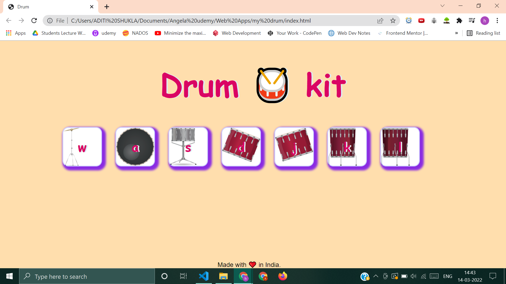
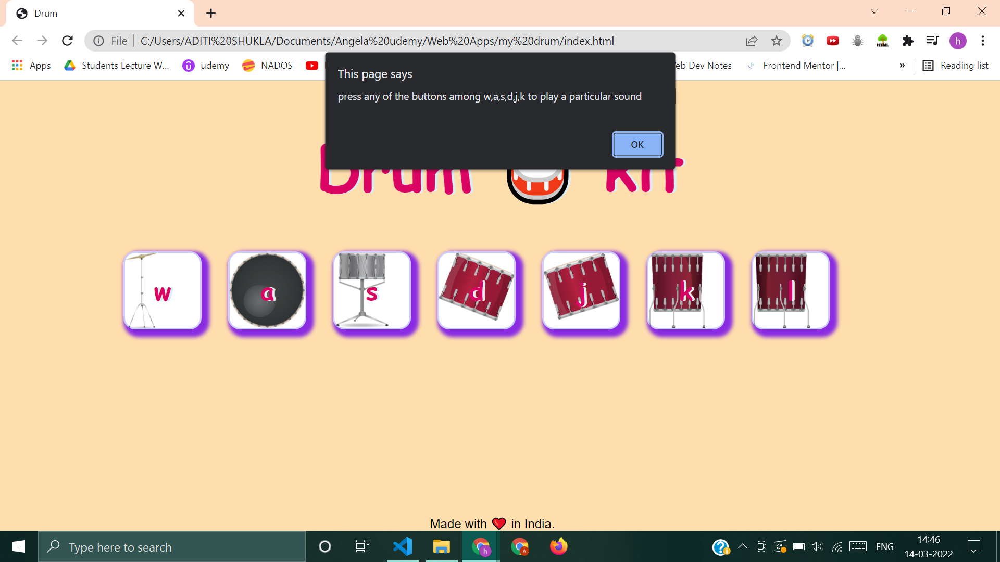

# Drum 🥁 Kit 
It is a game where a user can click on buttons or can press keyboard button to play sounds displayed in screen.this is a project I made while learning web development 

# Technologies used 
1. HTML
2. CSS 
3. JAVASCRIPT

# Screenshot

🌟**Press the button that are visible on buttons to play the sound** 

# The webSite is hosted here 👉
[Drum kit](https://aditishukla0111.github.io/DrumKit/)
